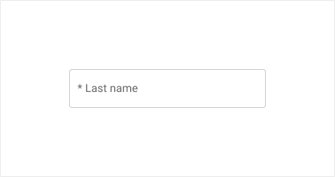
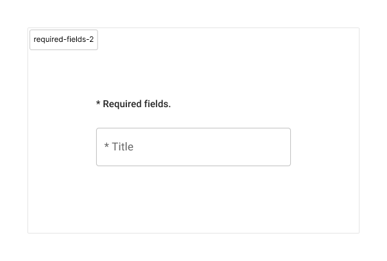

# UX/UI guidelines
{: .no_toc }

## Table of Contents
{: .no_toc .text-delta }

- TOC
{:toc}

## General page template

## Data grid

## Required fields
When information is required to proceed:
* Required field(s) should show an asterisk `*` **before** the label.

* Above required field(s), explain what the asterisk does. Add the following text: `* Required fields.`
This message is displayed once, after any title and before required field(s). Use the typography style `subtitle2`. 

## Modal

## Tooltip